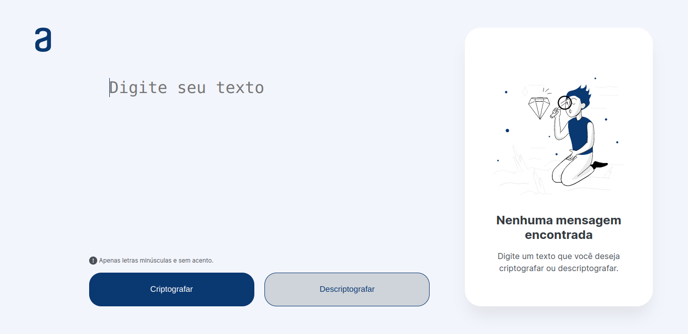
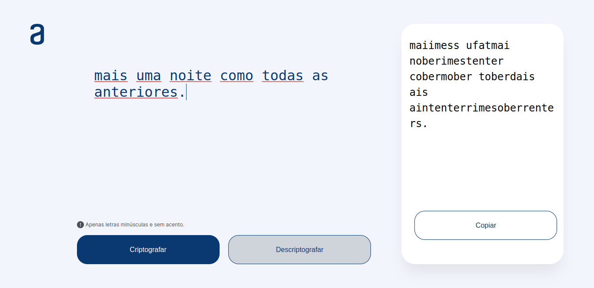
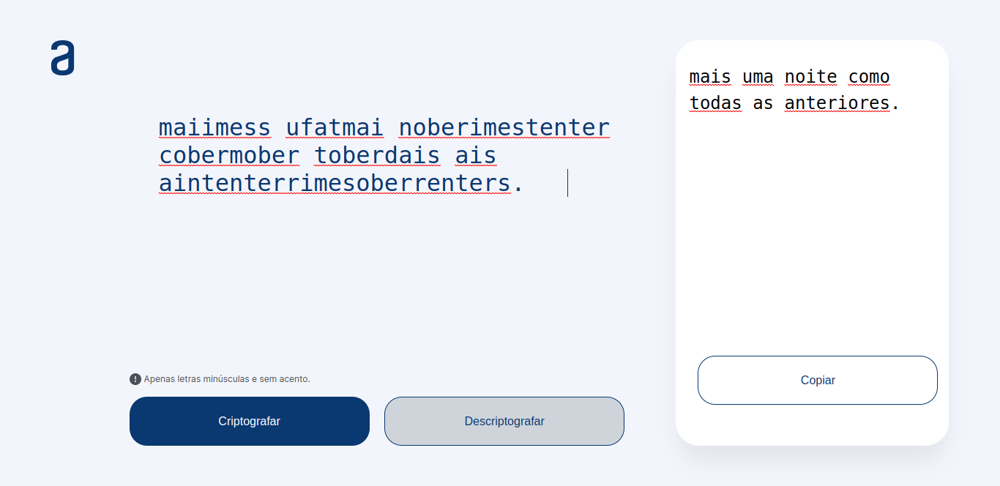

# Decodificador de Texto

Desafio desenvolva um decodificador de texto do programa ONE da Oracle Next Education em parceria com a Alura e Alura Latam.

## Resumo

O desafio proposto consiste na criação de um layout 100% responsivo que possibilite o usuário digitar um texto no campo descrito e ao clicar no botão criptografar apareça ao lado o texto criptografado, ao clicar no botão descriptografar apareça o texto descriptografado ao lado, além disso o usuário tem a opção de copiar o texto ao clicar no botão copiar e poder colá-lo para criptografar ou descriptografar.

## Layouts

### Layout Inicial

### Criptografando Texto

### Descriptografando Texto

## Funcionalidades

<ul>
    <li>Criptografar texto</li>
    <li>Descriptografar texto</li>
    <li>Botão copiar texto para área de transferência</li>
</ul>

## Tecnologias Utilizadas

<ul>
    <li>HTML</li>
    <li>CSS</li>
    <li>JavaScript</li>
</ul>

Feito com 🖤 Álisson Romão Santos.

&copy; MIT LICENSE
